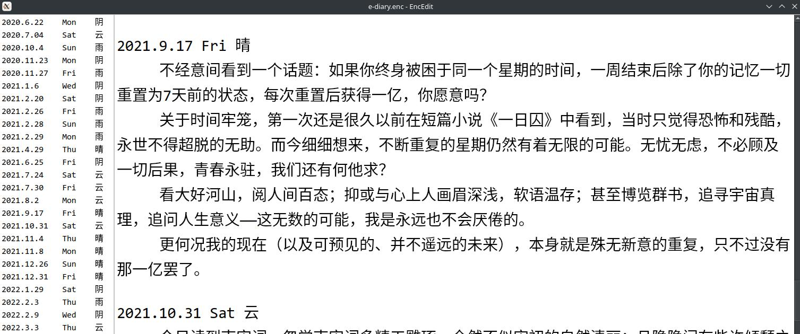
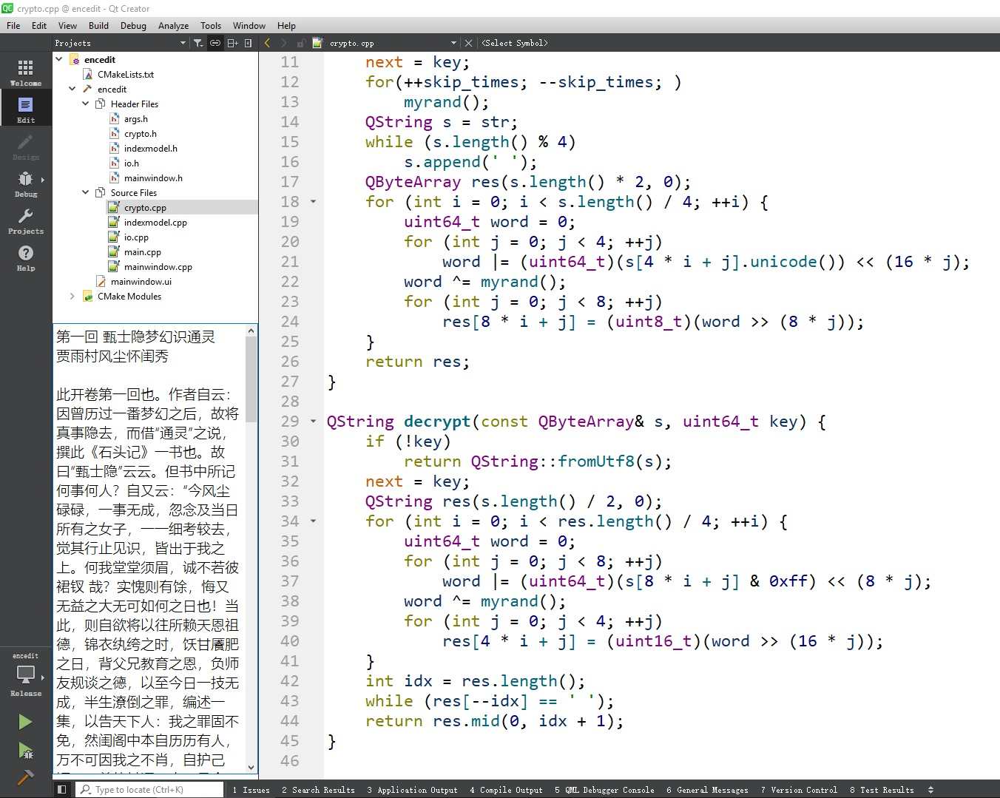

# EncEdit

Encedit - a simple and elegant plain text editor: write down anything while secured by encrytion!

version 2.4, copywrite (c) 2021~2022 by xsy, GPL v3 LICENSE.

## Features

- Primitive encryption;
- unicode and UTF-8 support;
- cross platform - tested on Windows and Linux KDE desktop;
- full keyboard support;
- automatic, customized index;
- customized font;
- customized background/foreground color;
- file history and custom settings memorized;
- simple window design;
- ultra-fast - faster than windows notepad in line wrapper mode on 10x scale;
- extremely low resource usage - usually about 20MB memory occupied;
- incremental encryption & save to avoid resource waste;
- and a lot more!

## Keyboard shotcuts

- Ctrl-\<NUM\>: open a recent file;
- Ctrl-H: show help on shotcuts;
- Ctrl-Alt-\<ARROW_KEY\>: adjust window position;
- Ctrl-A: select all;
- Ctrl-C: copy;
- Ctrl-X: cut;
- Ctrl-V: paste;
- Ctrl-Z: undo;
- Ctrl-Shift-Z/Ctrl-Y: redo;
- Ctrl-S: save current file;
- Ctrl-Shift-S: save as;
- Ctrl-N: new file;
- Ctrl-O: open file;
- Ctrl-F: select font family and size;
- Ctrl-L: select font color and background color;
- Ctrl-R: set index match rule (regular expression);
- Ctrl-T: toggle index (side widget) view;
- Ctrl-B: toggle frameless mode.

## Possible usage

### Keeping a diary

This function is what EncEdit is made for. The default title index match rule is designed for diary; see the left side of the image below:

Since texts are all encrypted, nobody can peek into you thoughts. But note that if you forget you password, all contents will be lost.

### 摸鱼

To enable this function, I further developed EncEdit from v2.0 to v2.3, while I was at a boring internship in an IT company.

In order to read novels when you're at work, follow the steps below:

1. open a .txt document without entering the password;
2. resizing and moving the window to a suitable position;
3. adjust font and background color so that it merges into the background;
4. press Ctrl-T and Ctrl-B to make it frameless.

Enjoy!

## Change log

- v1.0: 2021.7.24 - basic encryption and UI
- v1.1: 2021.7.25 - dirty indication, keyboard shutcut and cursor history
- v1.2: 2021.7.28 - font size adjust and stronger encryption algorithm
- v1.3: 2021.8.4 - enhanced encryption (from 16bit to 64bit) and improve UI
- v2.0: 2022.1.9 - reorganize project with improved efficiency
- v2.1: 2022.8.8 - font & index title customize; change status file path to system default
- v2.2: 2022.8.12 - automatic window layout adjust; remove icons and menus for full keyboard control; customize font color
- v2.3: 2022.8.23 - improve docs; direct open mode w/o encryption; inline welcome message
- v2.4: 2022.9.9 - fixed 4+ bugs in v2.3; add history list; manual window position minor adjust; improved custom config management
